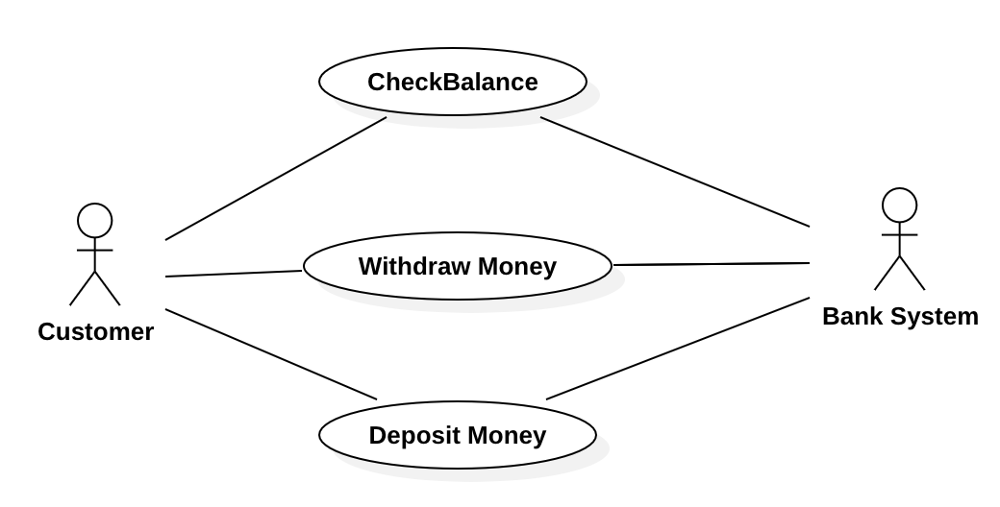

# Lab 1 Solutions
## Question 1

## Question 2
We have 2 solutions 
### 2.1 Solution 1

### 2.2 Solution 2

## Question 3
### 3.1 Problem Description:

A **Project Manager** manages **multiple projects**. A **project**, before **final release**, is
required to have a specified **feature set**. Associated with a **project** are **multiple
releases**. A **release** is a **functional piece** of the **project** being developed that
includes a **subset of the feature set** for the **project** and which is to be delivered on a
**specified date** (the **feature set** and **release date** are determined by the **Project
Manager**). When the **last release** is delivered, the **project** is considered completed.
Associated with each **feature** for a **project** is a **developer** who is responsible for
developing this **feature** for inclusion in the **project**. A **developer** has an **id** and
provides, for each **feature** he is responsible for, the **estimated time** **remaining to
complete work** on that **feature**. The **Project Manager** assigns **features** to **developers**
to work on.

### 3.2 List of Noun Phrases

project Manager

multiple projects

project

final release

feature set

project

multiple releases

release

functional piece

project

specified date

feature set

release date

project manager

last release

project

feature

project

developer id

feature

estimated time remaining

work

feature

project manager

features

developers

### 3.3 Sort and Eliminate Duplicates

- developer
- estimated time remaining
- feature set
- final release
- functional piece
- last release
- project
- project manager
- release
- release date
- specified date
- work

### 3.4 Static class diagram

## Question 4

