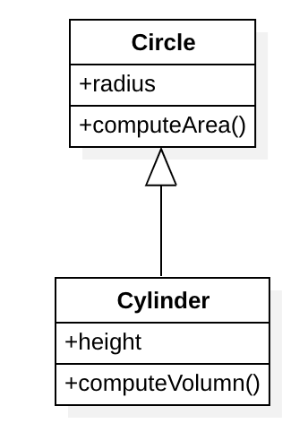
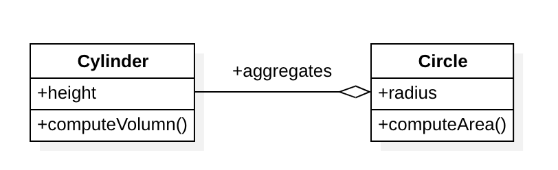

# Lab 3 Solutions
## Question 1
This approach violates symmetry or transitivity property, which are crucial properties of the equals method.
The subclass compares the attribute which is not shared from superclass.
To resolve the problem, we need to redesign using composition.

## Question 3

A. The idea that "a Cylinder is a Circle" is conceptually flawed.While a cylinder has a circular base, it is not a circle.
And also violates the LSP principle.
The relationship between a Circle and a Cylinder is better described as "a Cylinder has-a Circle as its base."
So we should use Composition instead.

**B. Why Composition Makes Sense**

Using composition, the Cylinder has-a Circle. The Circle class is embedded in the Cylinder class, representing the circular base.

**This design:**

* Separates the concerns of 2D (Circle) and 3D (Cylinder) shapes.
* Avoids misusing inheritance to create artificial relationships.

## Question 4
Implemented classes by the below design. `Property` is a common interface for the `House, Condominium, Trailer`. They are best practices for using inheritance. Example: `House` **IS-A** `Property`
Please see the implementation code from [this package link](https://github.com/vietnguyen/MPP_GroupB/tree/74f3368b5da95f68c826395d37584298b76223bf/src/Lab3/prob4)

