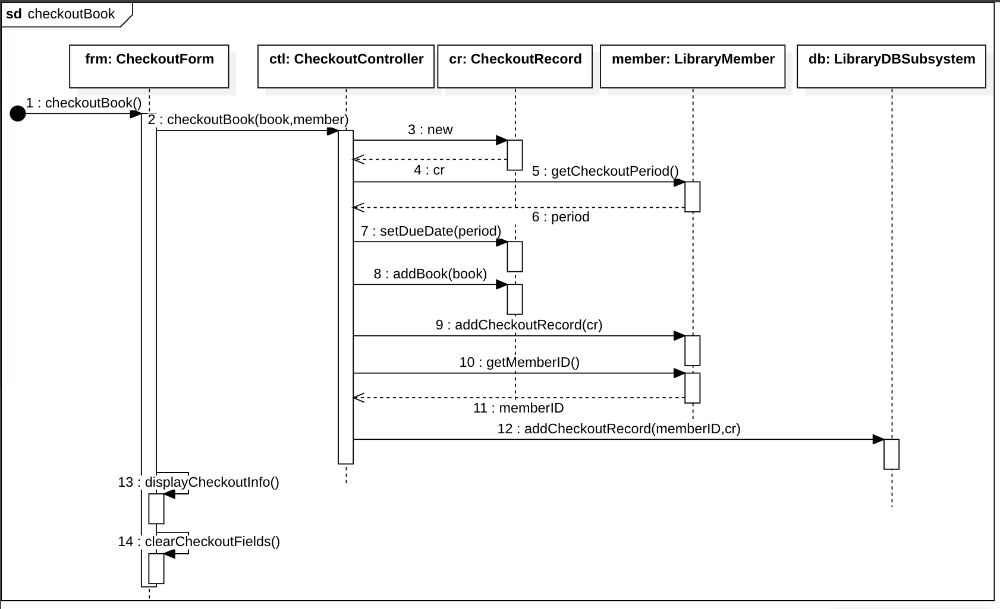

# Lab4 Solutions
## Question A

## Question B

## Question C
See source code for [Question C here](https://github.com/vietnguyen/MPP_GroupB/tree/e4e3c2b2d782870379a7fc74f30773d06a867ba9/src/Lab4/probC)
