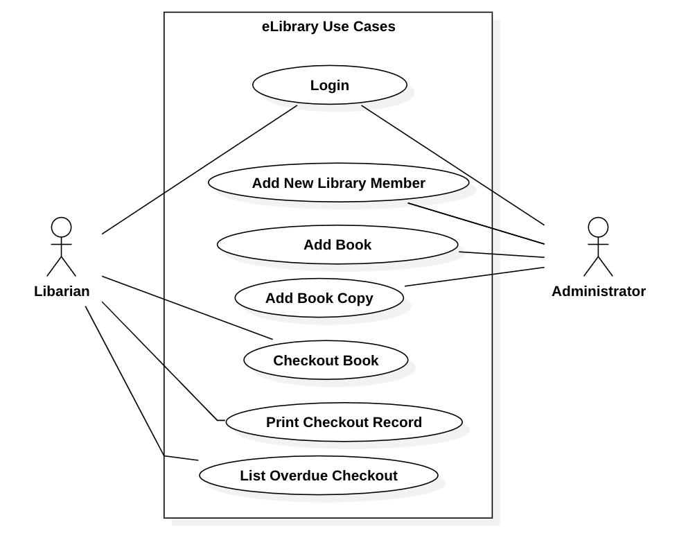
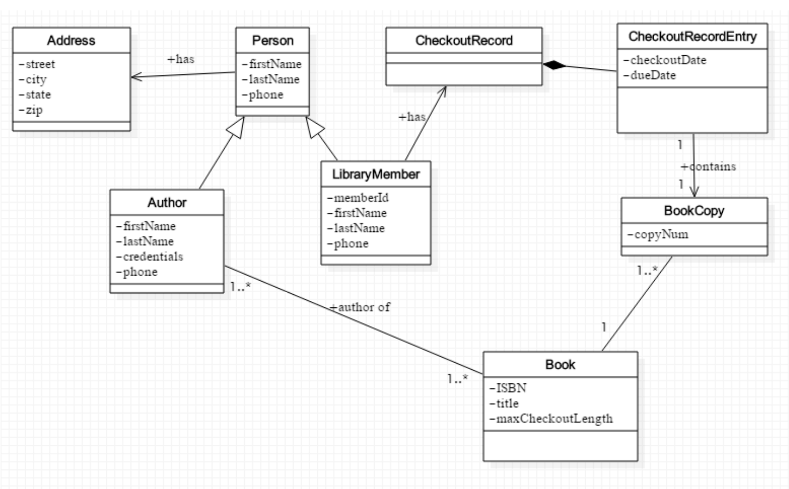
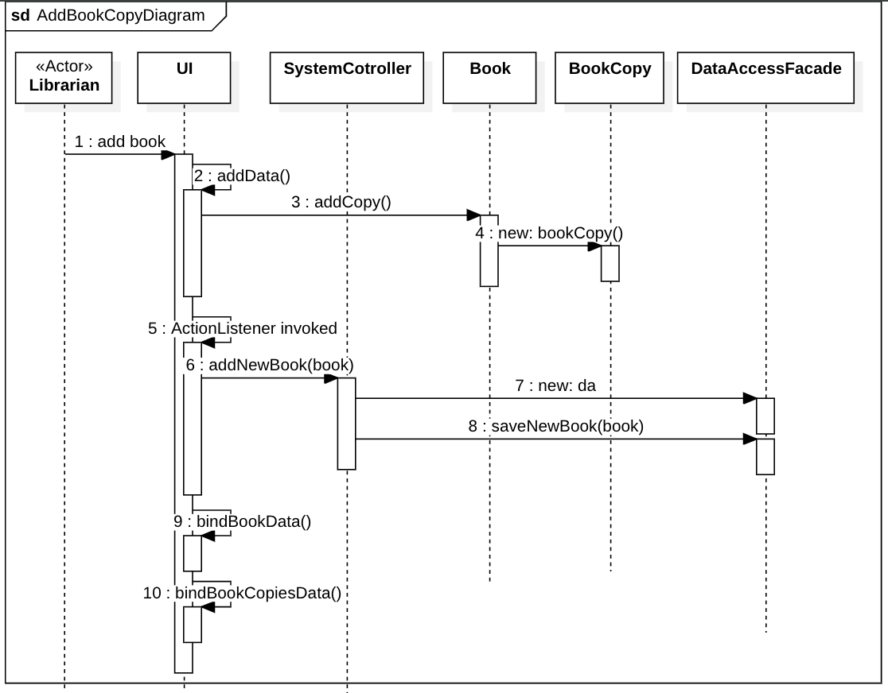
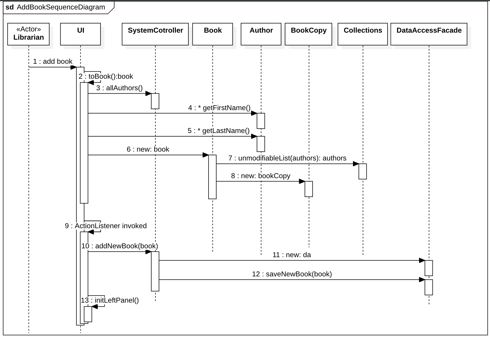

# GROUP B Midterm Project Solutions
## I. Use Cases

## II. Class Diagram

## III. Sequence Diagram

### 1.Login Sequence Diagram
### 2.Add New Library Member Sequence Diagram
### 3.Checkout Book Sequence Diagram
### 4.Add Copy Sequence Diagram

### 5.Add Book Sequence Diagram

### 6.Print Checkout Record Sequence Diagram

### 7.Overdue Checkout Record Sequence Diagram

## IV. UI
### Demo

